# PS4-Saves-I

Saves de PlayStation 4 — **37 títulos**, 2,0G.

Estrutura no padrão do console: `PS4/SAVEDATA/6f5440249bc89152/<CUSA>/`.
Para restaurar, copie a pasta `PS4` para a raiz de um pendrive formatado em exFAT
e use *Configurações → Gerenciamento de dados salvos → Armazenamento USB*.

> Os saves são vinculados à conta `6f5440249bc89152`. Em outra conta exigem
> re-assinatura (Save Wizard, Apollo ou similar).

Títulos marcados com ⚠️ estão em zip dividido em volumes de 90 MB, porque o
GitHub rejeita arquivos acima de 100 MB. Para restaurar, junte os volumes antes:

```bash
zip -s 0 CUSA09209.zip --out completo.zip   # junta .z01, .z02... + .zip
unzip completo.zip -d CUSA09209
```

| | Título | CUSA | Slots | Tamanho |
|---|---|---|---:|---:|
| 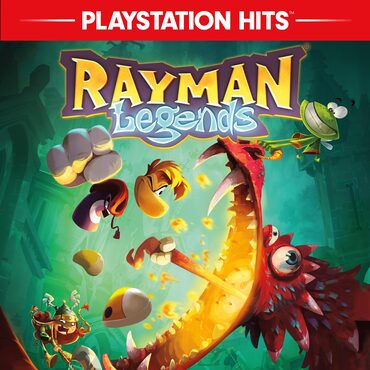 | Rayman Legends | `CUSA00069` | 1 | 10,0 MB |
| 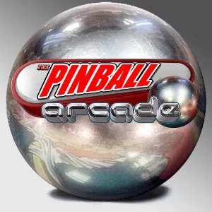 | Pinball Arcade | `CUSA00081` | 1 | 10,0 MB |
|  | Grand Theft Auto V | `CUSA00419` | 6 | 118,0 MB |
| 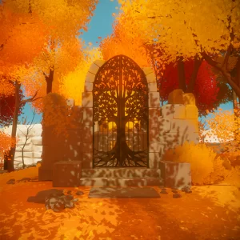 | The Witness | `CUSA00498` | 1 | 3,0 MB |
| 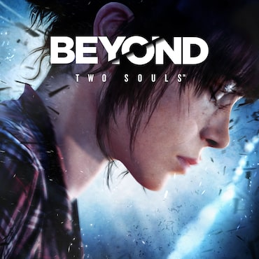 | Beyond: Two Souls | `CUSA00504` | 2 | 36,0 MB |
| 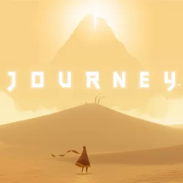 | Journey | `CUSA00694` | 1 | 10,0 MB |
| 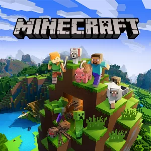 | Minecraft: PlayStation®4 Edition ⚠️ zip dividido | `CUSA00744` | 3 | 267,1 MB |
| 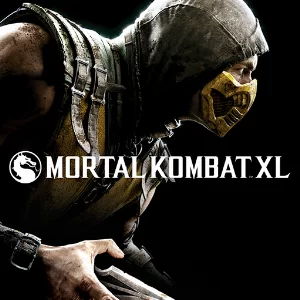 | Mortal Kombat X | `CUSA00967` | 3 | 30,0 MB |
|  | Rocket League® | `CUSA01163` | 1 | 100,0 MB |
| 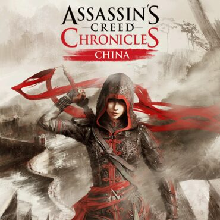 | Assassin's Creed Chronicles: China | `CUSA01347` | 1 | 10,0 MB |
| 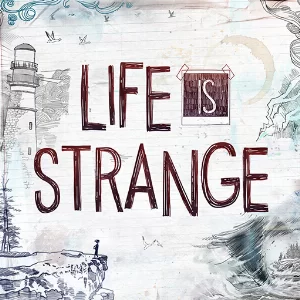 | Life Is Strange™ | `CUSA01442` | 4 | 40,0 MB |
| 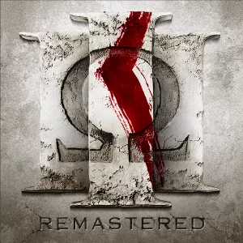 | God of War® III Remastered | `CUSA01623` | 8 | 80,0 MB |
|  | Horizon Zero Dawn | `CUSA01967` | 13 | 63,0 MB |
| 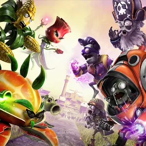 | Plants vs Zombies GW2 | `CUSA01975` | 1 | 18,0 MB |
| 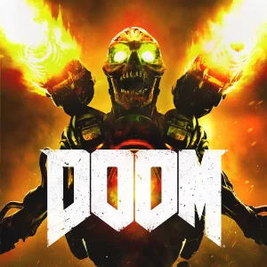 | DOOM | `CUSA02085` | 2 | 20,0 MB |
|  | Kung Fu Panda: Showdown of Legendary Legends | `CUSA02411` | 1 | 10,0 MB |
|  | Goat Simulator | `CUSA02768` | 1 | 10,0 MB |
| 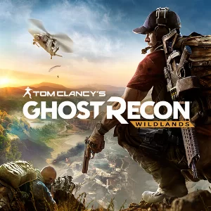 | Tom Clancy's Ghost Recon® Wildlands | `CUSA02819` | 1 | 3,0 MB |
| 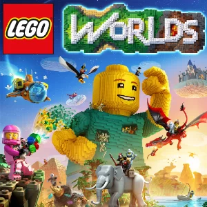 | LEGO® Worlds | `CUSA02985` | 6 | 145,0 MB |
| 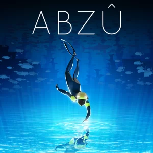 | ABZU | `CUSA03349` | 1 | 3,2 MB |
|  | Fallout 4 | `CUSA03448` | 20 | 154,6 MB |
| 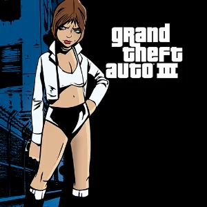 | Grand Theft Auto 3 | `CUSA03508` | 1 | 18,3 MB |
|  | F1™ 2016 | `CUSA04517` | 1 | 23,0 MB |
| 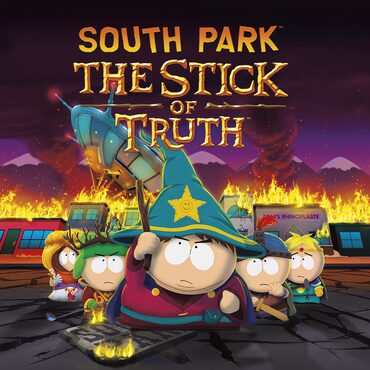 | South Park: The Stick of Truth | `CUSA04768` | 4 | 40,1 MB |
| 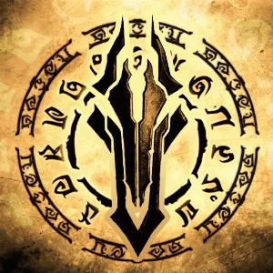 | Darksiders Warmastered Edition | `CUSA05347` | 1 | 3,0 MB |
| 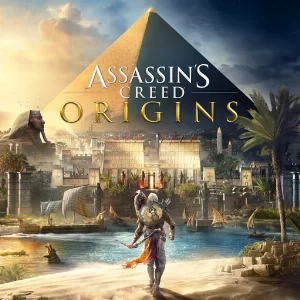 | Assassin's Creed® Origins | `CUSA05625` | 1 | 10,0 MB |
| 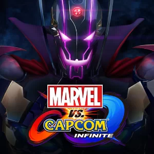 | MARVEL VS. CAPCOM: INFINITE | `CUSA06400` | 2 | 8,3 MB |
| 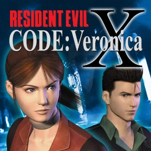 | RESIDENT EVIL™ CODE: Veronica X | `CUSA07104` | 1 | 18,3 MB |
| 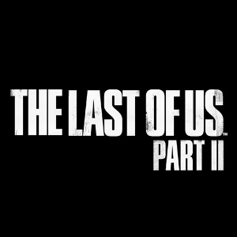 | The Last of Us™ Part II | `CUSA07820` | 5 | 31,3 MB |
| 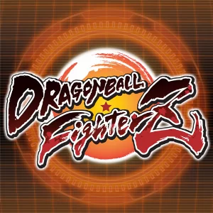 | DRAGON BALL FighterZ | `CUSA09072` | 2 | 62,5 MB |
| 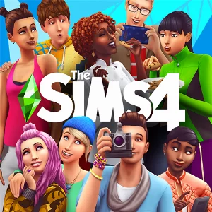 | The Sims™ 4 ⚠️ zip dividido | `CUSA09209` | 6 | 526,1 MB |
| 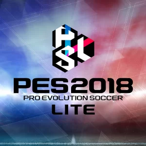 | PRO EVOLUTION SOCCER 2018 LITE | `CUSA10090` | 2 | 14,4 MB |
|  | EA SPORTS™ UFC® 4 | `CUSA14204` | 4 | 72,0 MB |
| 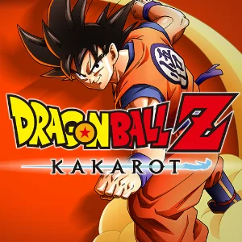 | DRAGON BALL Z: KAKAROT | `CUSA14655` | 2 | 22,8 MB |
| 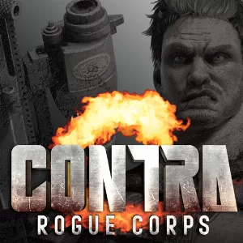 | CONTRA: ROGUE CORPS | `CUSA15024` | 1 | 3,0 MB |
| 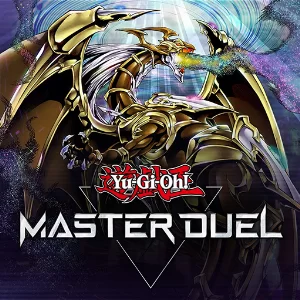 | Yu-Gi-Oh! Master Duel | `CUSA24659` | 1 | 11,0 MB |
| 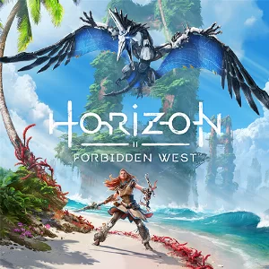 | Horizon Forbidden West | `CUSA24705` | 17 | 83,0 MB |

<sub>Gerado por `tools/build_index.sh` — não edite esta tabela à mão.</sub>
